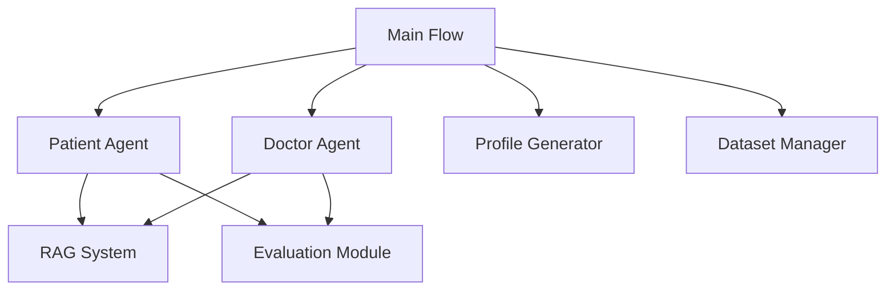

# EvoPatient
The official repository for our paper [LLMs Can Simulate Standardized Patients via Agent Coevolution](https://arxiv.org/abs/2412.11716).

## A Note from the Author
*As the author, I would like to share a few words at the beginning. This project was initially developed when I first entered graduate school, together with several collaborators who shared a strong interest in multi-agent systems. Since we were often working remotely, parts of the code inevitably became somewhat repetitive and loosely organized. I apologize for that.*

*Many researchers have recently reached out to ask whether this code could be open-sourced. After careful consideration, I decided to release it as is — as a demo version of our internal system — even though it has not been fully cleaned up. I understand that reproducing a complex multi-agent system can be time-consuming, and I hope this repository can serve as a useful reference or starting point for others to build upon and improve.*

*I welcome anyone to contact me by email if you need assistance in reproducing or extending the system. When time allows, I plan to continue refining and improving this project. I believe that sharing — even if imperfect — is better than withholding, and that “something is better than nothing.”*


# Simulated Patient System

A multi-agent simulation system for medical diagnosis that mimics patient-doctor interactions using large language models. This is the official repository for the paper "[LLMs Can Simulate Standardized Patients via Agent Coevolution](https://arxiv.org/abs/2412.11716)".

## Overview

This project implements a sophisticated multi-agent system that simulates realistic patient-doctor interactions in a medical setting. The system consists of:

- **Patient Agents**: Simulate real patients with specific medical conditions, backgrounds, and personalities
- **Doctor Agents**: Represent medical professionals from various specialties who diagnose patients
- **RAG System**: Retrieves relevant medical information to support diagnostic decisions
- **Evaluation Framework**: Assesses the quality of interactions and diagnostic accuracy

## Key Features

### Multi-Agent Architecture
- Dynamic recruitment of specialist doctors based on patient symptoms
- Hierarchical doctor-patient interaction with multiple medical specialties
- Support for different topologies (DAG, tree, chain) for doctor collaboration

### Realistic Patient Simulation
- Diverse patient profiles with detailed backgrounds (age, gender, medical history, etc.)
- Natural language responses that mimic real patient communication patterns
- Crisis scenarios for emergency response training

### Intelligent Doctor Agents
- Specialized knowledge in different medical fields
- Adaptive questioning based on patient responses
- Collaborative diagnosis with other specialist doctors

### Retrieval-Augmented Generation (RAG)
- Context-aware information retrieval for accurate medical responses
- Dynamic information fetching based on current diagnostic needs

### Evaluation System
- Automated assessment of response quality and relevance
- Metrics for faithfulness, context relevance, and human-likeness
- Performance tracking and analysis tools

## System Architecture



## Components

### 1. Patient Agent (`Simulated/simulated_patient/patient_agent.py`)
- Generates patient profiles with realistic characteristics
- Produces natural language responses to medical questions
- Simulates emergency scenarios during consultations

### 2. Doctor Agent (`Simulated/simulated_patient/doctor_agent.py`)
- Represents medical specialists from various departments
- Dynamically recruits additional specialists when needed
- Makes diagnostic decisions based on patient information

### 3. RAG System (`RAG/`)
- Retrieves relevant medical information for accurate responses
- Supports context-aware information retrieval

### 4. Evaluation Framework (`make_task/`)
- Assesses response quality using multiple metrics
- Provides quantitative analysis of agent performance

## Getting Started

### Prerequisites
- Python 3.8+
- Required packages listed in `requirements.txt`
- OpenAI API key or compatible LLM endpoint

### Installation
```bash
pip install -r requirements.txt
```

### API Key Configuration
Before running the simulation, you need to configure your API keys:

1. **OpenAI API Key**:
   - Edit `Simulated/simulated_patient/api_call.py` 
   - Replace the API key in the `OpenAI` client initialization

2. **Embedding API Key**:
   - Edit `Simulated/simulated_patient/agent_evolve.py`
   - Update the API key and endpoint configuration

3. **Profile Generator API Key**:
   - Edit `profile/profile_generator.py`
   - Modify the `OpenAI` client credentials

### Running the Simulation
```bash
python run.py
```

The system will automatically:
1. Load patient data from the dataset
2. Generate a patient profile
3. Simulate a doctor-patient consultation
4. Evaluate the interaction quality
5. Save results for analysis

## Data Structure

```
Simulated-patient/
├── dataset/                 # Medical patient data
├── profile/                 # Patient profile generation
├── Simulated/               # Core agent implementations
│   ├── simulated_patient/   # Patient and doctor agents
│   └── Prompt/              # LLM prompting templates
├── RAG/                     # Retrieval-augmented generation
├── make_task/               # Evaluation and analysis
└── run.py                   # Main execution script
```

## Configuration

### LLM API Settings
Update API credentials in:
- `Simulated/simulated_patient/api_call.py`
- `embedding_function/qwen_embedding.py`
- `profile/profile_generator.py`

### Simulation Parameters
Adjust settings in:
- `simulateflow.py` - Control simulation flow and parameters
- `run.py` - Configure dataset selection and iteration

## Evaluation Metrics

**Metrics for Patient Agent**

- **Relevance:** Does the answer directly address the question asked, without unnecessary information?
- **Faithfulness:** Is the answer based solely on the provided medical information and scenario requirements?
- **Robustness:** Does the answer avoid inappropriately disclosing sensitive information (like disease names or excessive details) that a doctor should not easily extract?

**Metrics for Doctor Agent**

- **Specificity:** Is the question precise, unambiguous, and focused on specific, relevant details?
- **Targetedness:** Is the question meaningful and efficient for gathering necessary diagnostic information?
- **Professionalism:** Does the question use appropriate medical terminology and reflect an understanding of clinical principles and guidelines?


## 🎥 Demo Video
https://github.com/user-attachments/assets/7a433d03-5f9b-4ada-a491-7c6539cad07e

*EvoPatient system demonstration - showing standardized patient simulation through agent coevolution*

## Citation
```
@inproceedings{du-etal-2025-llms,
    title = {LLMs Can Simulate Standardized Patients via Agent Coevolution},
    author={Du, Zhuoyun and Qian, Chen and Liu, Wei and Xie, Zihao and Wang, Yifei and Qiu, Rennai and Dang, Yufan and Chen, Weize and Yang, Cheng and Tian, Ye and others},
    booktitle = {Proceedings of the 63rd Annual Meeting of the Association for Computational Linguistics (Volume 1: Long Papers)}
    pages = {17278--17306},
    year = {2025},
}
```

## License

This project is licensed under the MIT License - see the LICENSE file for details.